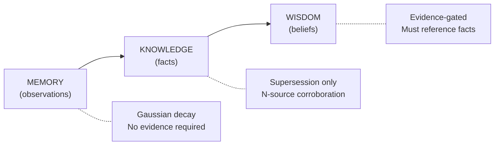

# Engrammic Technical Overview

**Version:** 0.x (Pre-seed)  
**Date:** June 2026

## Executive Summary

Engrammic is a memory infrastructure layer for AI agents that solves a fundamental category error in how agent systems persist information. Instead of treating all data with uniform decay or retrieval semantics, we separate persistence into four epistemically-distinct layers, each with its own lifecycle rules.

The core differentiator: **corroboration before promotion**. When an agent stores a claim, we check if other sources have said the same thing. Three independent sources agreeing? That claim becomes a fact. One source from official docs with high confidence? Also a fact. Otherwise it stays a claim - retrievable, but flagged as unverified. When an agent forms a conclusion, it must link to the nodes it's concluding from - we store that chain so you can trace any belief back to what it's based on. The confidence math is a formula (source tier x corroboration x method weight x raw confidence), not an LLM call - deterministic, auditable, and costs nothing after extraction.

---

## The Problem: Category Error in RAG

Standard RAG and memory systems apply a single persistence model to fundamentally different types of information:

| Information Type | Example | Correct Semantics |
|-----------------|---------|-------------------|
| Ephemeral observation | "User mentioned auth at 14:32" | Gaussian decay |
| Validated fact | "OAuth tokens expire in 30 days" | Indefinite until contradicted |
| Synthesized belief | "This team ships on Fridays" | Evidence-gated revision |
| Query-time reasoning | "Considering facts A, B, C..." | Ephemeral, never persisted |

Treating these uniformly causes systematic failures. A decaying Slack message is correct behavior. A decaying validated fact is a bug. This category error is documented in Roynard (2026) [1].

The result in production: mem0 users report 97.8% junk accumulation rates [2], contradiction failures when facts change [3], and no stale decay mechanism [4]. HaluMem (2025) confirms hallucination accumulates systematically in ADD-only memory systems [5].

---

## Architecture: EAG (Epistemic Augmented Generation)

### Four-Layer Model

**Intelligence Layer** (not shown): Ephemeral reasoning chains generated at query time. Never persisted beyond the session.

### Transitions Are Gated

| Transition | Gate | Implementation |
|------------|------|----------------|
| Memory to Knowledge | N-source corroboration | Custodian counts distinct sources of same (subject, predicate, object) |
| Knowledge to Wisdom | Synthesis threshold | Validator requires K supporting facts before belief formation |
| Fact supersession | Contradiction detection | Structural first (same s/p, different o), LLM fallback for semantic edge cases |

This is the moat. Competitors store memories and retrieve them. We adjudicate claims and track when conclusions change.

---

## Deterministic Epistemology

All adjudication logic is pure functions over structured claims. LLM calls happen at extraction time (turning text into claims), never at promotion or synthesis time.

### Confidence Math

$$C = \tau \cdot \kappa \cdot \mu \cdot \rho$$

**Legend:**
- $C$ = combined confidence (0.0 - 1.0)
- $\tau$ = source tier weight
- $\kappa$ = corroboration factor = $1 - e^{-0.5n}$ where $n$ = distinct sources
- $\mu$ = method weight (extraction quality)
- $\rho$ = raw confidence (LLM self-reported)

| Factor | Values |
|--------|--------|
| source_tier | 1.0 authoritative, 0.85 validated, 0.6 community, 0.4 unknown |
| corroboration_factor | 1 - exp(-0.5 * n) where n = distinct corroborating sources |
| method_weight | 0.85 validated extractor, 0.75 standard, 0.6 experimental |
| raw_confidence | LLM self-reported extraction confidence (0..1) |

**Consequence:** Promotion decisions are replayable, auditable, and cost $0 after extraction.

### Provenance Invariants (enforced at write time)

- Every Fact has at least one DERIVED_FROM edge to a Memory-layer source
- Every Belief has at least N SYNTHESIZED_FROM edges to Facts
- No cycles in provenance (edges always point backward in layer order)
- SUPERSEDES edges require explicit reason (contradiction, evidence_shift, author_update, evidence_erased)

Violations are rejected, not logged.

---

## Retrieval: Hybrid Search with Adaptive Truncation

### Search Pipeline

1. **Query expansion** (optional): Generate related queries for broader coverage
2. **Hybrid retrieval**: Dense (embedding) + sparse (BM25) with RRF fusion
3. **Graph traversal**: Optional depth > 0 follows provenance edges
4. **Semantic reranking**: Cross-encoder rescores candidates
5. **Adaptive truncation**: Score-dependent threshold filters noise

### Adaptive Threshold (SmartSearch)

Instead of fixed top-k truncation, we use a query-dependent threshold:

$$\tau = \alpha \cdot \max(S)$$

Where $\alpha \in [0.5, 0.8]$ and $S$ is the set of relevance scores.

High-confidence queries (max score ~0.9) return more results. Low-confidence queries (max score ~0.5) return fewer, reducing noise and hallucination risk. Based on SmartSearch [6].

### Graph Recall (HippoRAG-derived)

For queries requiring multi-hop reasoning, we run Personalized PageRank over the knowledge graph seeded by initial retrieval anchors. Implementation draws from HippoRAG 2 [7] (MIT license):

- PPR with damping ~0.5 for stronger anchor personalization
- Node-weight fusion combining dense and sparse seed scores
- Bounded k-hop subgraph (not full silo traversal)

---

## Multi-Tenancy and Isolation

### Silo Architecture

Every operation is scoped to a `silo_id`. Silos provide:

- Complete data isolation (no cross-silo queries)
- Per-silo threshold configuration
- Independent lifecycle (GDPR erasure at silo level)

### Authentication

WorkOS-backed org-first model. Every user belongs to an organization. Organizations own silos.

---

## Background Processing: SAGE Pipeline

The SAGE (Synthesis, Adjudication, Groundskeeping, Extraction) pipeline runs asynchronously via Dagster:

| Agent | Role |
|-------|------|
| **Custodian** | Contradiction detection, promotion decisions, consensus counting |
| **Synthesizer** | Belief formation from corroborated facts |
| **Groundskeeper** | Decay application, stale node cleanup, heat-based prioritization |
| **Validator** | Belief verification, evidence checking |

### Reactive vs Scheduled

The reactive architecture (triggered by writes and recalls) is ~3.5x cheaper than scheduled batch processing:

| Nodes/month | Reactive | Scheduled | Savings |
|-------------|----------|-----------|---------|
| 10K | $5.38 | $18.90 | 73% |
| 100K | $54 | $189 | 71% |

**Why:** No idle processing. Synthesis triggers on recall (lazy evaluation). Deterministic conflict resolution runs before any LLM call.

---

## Performance Targets

| Operation | Target |
|-----------|--------|
| recall (cached) | < 20ms |
| recall (search) | < 250ms |
| recall (graph depth 2) | < 500ms |
| remember / learn (write) | < 300ms p95 |
| link | < 100ms |

---

## Cost Model (Managed Service)

### Fixed Infrastructure

| Component | Monthly |
|-----------|---------|
| Compute (e2-medium) | ~$25 |
| Cloud SQL | ~$10 |
| Artifact Registry | ~$5 |
| **Total fixed** | **~$40** |

### Per-User Cost at Scale

| Users | API Cost | + Infra | Per-user |
|-------|----------|---------|----------|
| 10 | ~$8 | $40 | $4.80 |
| 50 | ~$35 | $40 | $1.50 |
| 200 | ~$130 | $80 | $1.05 |
| 1000 | ~$600 | $200 | $0.80 |

Primary cost driver at low scale: semantic reranking (~80% of API spend).

---

## Competitive Positioning

| Capability | Engrammic | mem0 | Zep/Graphiti |
|------------|-----------|------|--------------|
| Multi-layer persistence | Yes | No (flat) | Partial (2 types) |
| Evidence-gated promotion | Yes | No | No |
| Belief derivation | Yes | No | No |
| Temporal provenance | Yes | No | Yes |
| Contradiction detection | Yes (structural + semantic) | No | Yes (LLM only) |
| Org-first multi-tenancy | Yes | Partial | No |
| Deterministic adjudication | Yes | N/A | No |

**Key differentiator:** Zep/Graphiti tracks where knowledge came from and when it changed (temporal provenance). We do that AND adjudicate whether claims should become facts and facts should become beliefs. They store and supersede. We derive and gate.

---

## References

[1] Roynard, "Category Errors in Retrieval-Augmented Generation," arXiv:2604.11364v1, April 2026.

[2] mem0 GitHub Issue #4573: "97.8% of extracted memories are junk."

[3] mem0 GitHub Issue #4896: "ADD-only extraction fails on contradictions." Closed "not planned."

[4] mem0 GitHub Issue #5330: "No stale decay mechanism."

[5] "HaluMem: Hallucination Accumulation in Memory-Augmented LLMs," arXiv:2511.03506, 2025.

[6] "SmartSearch: Score-Adaptive Truncation for Neural Retrieval," arXiv:2603.15599, 2026.

[7] HippoRAG 2, https://github.com/OSU-NLP-Group/HippoRAG (MIT License).

[8] "Multi-Agent System Failures in Production," arXiv:2503.13657, 2025. (41-87% failure rates, coordination at ~36.9%)

[9] "Compounding Reliability in Agentic Systems," arXiv:2510.25423v2, 2025. (85% per-step accuracy collapses to ~27% over 8 steps)

[10] "Belief Graphs with Reasoning Zones," arXiv:2510.10042, 2025. (Confidence propagation algorithms)

[11] Zep/Graphiti, "Temporal Knowledge Graphs for LLM Memory," arXiv:2501.13956, 2025.

---

## Appendix: MCP Tool Surface

The agent-facing API is intent-based, not CRUD:

| Verb | Layer | Purpose |
|------|-------|---------|
| remember | Memory | Store observation (no evidence required) |
| learn | Knowledge | Store claim with evidence |
| believe | Wisdom | Declare conclusion from facts |
| recall | All | Query by text or node ID |
| trace | Meta | Provenance (where did this come from?) |
| history | Meta | Versioning (how did this evolve?) |
| link | All | Create typed relationship |
| hypothesize | Intelligence | Tentative belief (session-scoped) |
| commit | Intelligence | Crystallize hypotheses to Wisdom |
| forget | All | Request deletion |

---

## Contact

Technical questions: [technical founder email]  
Product/partnership: [BD contact]
